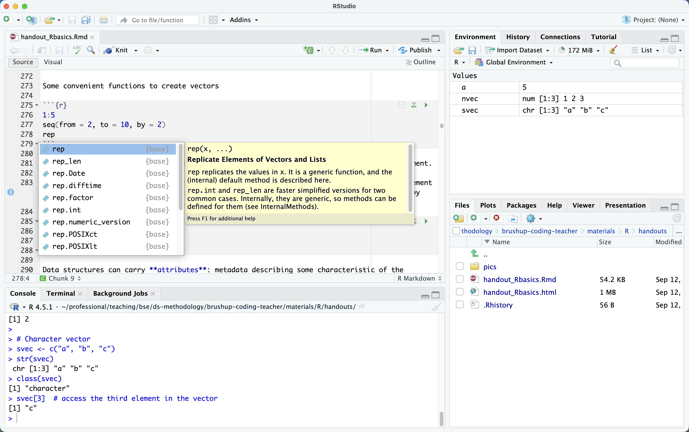

```{r, knitr_options, include=FALSE}
    
    # loading in required packages
    if (!require("knitr")) install.packages("knitr"); library(knitr)
    if (!require("rmarkdown")) install.packages("rmarkdown"); library(rmarkdown)

    # some useful global defaults
    opts_chunk$set(warning=FALSE, message=FALSE, include=TRUE, echo=TRUE, cache=FALSE, cache.comments=FALSE, comment='##')

    # output specific defaults
    output <- opts_knit$get("rmarkdown.pandoc.to")
    if (output == "html") opts_chunk$set(fig.width=10, fig.height=5)
    if (output == "latex") opts_chunk$set(fig.width=6,  fig.height=4,
        dev = 'cairo_pdf', dev.args=list(family="Arial"))
```

# Introduction 

R is the standard environment in statistics and econometrics research, and it is widely used in data science teams in industry. It is also where new statistical methods tend to appear first: an active community maintains many thousands of packages, covering an extremely wide range of problems. Together with Python, it is one of the two languages you will use most in this program.

This course covers the essential topics to get started in R. It will also refresh your previous knowledge if you are already familiar with it. After the course you should be able to get data, perform basic statistical analyses, and present your results in graphical form.

## General references

- *A (Very) Short Introduction to R*, Paul Torfs & Claudia Brauer: A 12-page introduction covering the essentials of this brush-up.^[[https://cran.r-project.org/doc/contrib/Torfs+Brauer-Short-R-Intro.pdf](https://cran.r-project.org/doc/contrib/Torfs+Brauer-Short-R-Intro.pdf)]
- *An Introduction to R*, W. N. Venables, D. M. Smith, and the R Core Team: The canonical introduction to R, with far more detail than strictly needed for this course.^[[https://cran.r-project.org/doc/manuals/R-intro.pdf](https://cran.r-project.org/doc/manuals/R-intro.pdf)]  
- *R for Data Science* (2nd edition), H. Wickham, M. Çetinkaya-Rundel & G. Grolemund: The standard modern introduction to doing data analysis in R. Free to read online.^[[https://r4ds.hadley.nz](https://r4ds.hadley.nz)]  
- *Advanced R* (2nd edition), H. Wickham: Designed primarily for R users who want to improve their programming skills and understanding of the language.^[[https://adv-r.hadley.nz](https://adv-r.hadley.nz)]

# Installing R

Download R (for free) from CRAN and install it.^[Available for Windows, Linux, and Mac from [cran.r-project.org/](https://cran.r-project.org/)] Default options are OK. In this official R site you can also download manuals and get help.

# Installing RStudio

You can run R by opening a terminal and typing `R`, but it is much more comfortable to work through RStudio — an IDE (integrated development environment) that is by some distance the most widely used way of writing R. It gives you syntax highlighting, automatic indentation, command tooltips, and integration with R Markdown and Shiny.

You can of course use any text editor and run your scripts from the terminal; VS Code with the REditorSupport extension is a common choice, and Vim, Emacs and Sublime Text all have R modes. But if you are starting out, use RStudio — it will make the first weeks noticeably easier.

After installing R, head to the RStudio [download page](https://posit.co/download/rstudio-desktop/) and get the installer for your OS. (RStudio is developed by a company called Posit, which is why the site name differs.)

When you open RStudio you get four panes:

1. **Console.** An R console, exactly like the one you would get in a terminal. Type an instruction, press Enter, and it runs.

2. **Editor.** Your open R scripts. Place the cursor on a line and press `Ctrl+Enter` (`Cmd+Enter` on a Mac) to run that line; select several lines and press the same combination to run all of them. To run the whole file, use `Ctrl+Shift+S` (`Cmd+Shift+S`).

3. **Environment and history.** The environment lists the objects currently defined in your session — click one to inspect it. The history tab shows the commands you have typed.

4. **Files, plots, packages and help.**



RStudio has a great many keyboard shortcuts and they are worth exploring. Three to start with: `Ctrl+1` moves the cursor to the editor, `Ctrl+2` to the console, and `Ctrl+Shift+C` comments or uncomments the selected lines. On a Mac, use `Cmd` in place of `Ctrl`. `Alt+Shift+K` brings up the full list.

# Getting help

It is hard to memorize everything. So, knowing how to look things up is one of the more useful programming skills. Start with R's own help files, via the `help` function or the `?` shorthand:

```R 
help(length)
?dim
```

These tell you what a function's arguments are, what it returns, and — at the bottom, usually the most useful part — give runnable examples.

If that is not enough, search the web (adding "function" or "package" to the query helps, since "R" on its own is not a distinctive search term) or ask a language model. Both are legitimate. What matters is what you do with the answer. It is easy to get something plausible-looking that you do not actually understand, so check it against the help files and make sure you could reconstruct it yourself afterwards. The course AI policy goes into this further.

# Using R 

## The R console

Your first interaction with R can be as simple as using a calculator: type an arithmetic operation and press `Enter`.

```{r} 
1 + 2
1 - 2
1 / 2
1 * 2
2^3
```

Common mathematical functions are built in and available immediately.

```{r} 
sin(5 / 2)
sqrt(2)
```

You assign a value to a named object with the `<-` operator.

```{r} 
a <- 5
```

This creates the variable `a`, holding the numeric value 5, in the current environment. Typing its name prints it back.

```{r} 
a
```

Note that R is case sensitive, so `a` and `A` are two different objects.

You will also see `=` used for assignment. Both work, but stick to `<-`: it is the convention in essentially all R style guides, and it keeps assignment visually distinct from passing an argument to a function. Compare `mean(x = 1:10)`, which sets the `x` argument of `mean`, with `mean(x <- 1:10)`, which creates a variable `x` and then passes it — a difference of one character with very different consequences.

Finally, some words are reserved and cannot be used as names: `if`, `else`, `repeat`, `while`, `function`, `for`, `in`, `next`, `break`, `TRUE`, `FALSE`, `NULL`, `Inf`, `NaN`, `NA` and its typed variants (`NA_integer_`, `NA_real_`, `NA_complex_`, `NA_character_`), and `...` along with `..1` through `..9`.

## R scripts

Typing into the console is fine for a quick calculation, but real work goes in a script. A script records the whole workflow of your analysis — from importing the data to saving the plots — so you can re-run it when the inputs change, hand it to someone else, or come back to later.

Open a new R script in RStudio^[Menu > File > New File > R Script] and save it. Start typing code — the calculations above will do. `Ctrl+Enter` (`Cmd+Enter` on a Mac) sends the current line to the console. Select several lines and the same combination runs all of them in order.

It is worth commenting your code as you write it. Section titles make a long file easier to navigate, and short descriptions of what a block is doing are invaluable when you revisit it later or share it. In R, anything after a `#` on a line is a comment and is not executed.

```R 
## Load and clean the data (section comment)

a <- 1  # a is a parameter (inline comment)
```

A saved script can also be run from another script by "sourcing" it with the `source` command. Everything the sourced script does — defining a function, creating a vector — then becomes available in the session that sourced it. This is how you split a long analysis across several files, keeping your functions in one place and the analysis that uses them in another.

```R 
source("relative_path/script.R")
source("/absolute_path/script.R")
```

Note that you have to specify the path to the script, and as in the shell, a relative path depends on where you currently are. You can check your working directory with `getwd` and change it with `setwd`.

```R 
getwd()
setwd("/absolute_path/to_some_dir/")
```

In RStudio you can also set it through Session > Set Working Directory.

A word of warning about `setwd`: a script containing `setwd("/Users/yourname/...")` will fail on every machine but your own, which makes it a common cause of "it works for me" problems. The better habit is to use an **RStudio Project** (File > New Project), which sets the working directory to the project folder automatically, and then refer to everything by relative paths from there.

# Installing & loading packages  

One of R's most powerful features is the wide array of packages written to solve particular problems. Some improve on base routines (`ggplot2` for graphics, say), others extend what R can do at all (database connectors), and many implement methods from narrow corners of a field. Think of a package as a collection of functions bundled with documentation. Being familiar with a few popular ones will make you considerably more productive.

Most packages live on CRAN, the official R repository, and are installed with `install.packages` from the console. We will use `dplyr` as the example.

```R 
install.packages("dplyr")
```

You only need to do this once per machine, unless you want to update the package. RStudio's Packages tab offers the same thing through a menu.^[Keep track of what you install and write the installation commands explicitly in a script, so you can set up another machine easily.]

Packages that are not on CRAN — usually ones still in development, or private ones — are often on GitHub. The `remotes` package installs those.

```R 
install.packages("remotes")
remotes::install_github("username/repository")
```

The `::` operator means "use the function `install_github` from the `remotes` package" without loading the whole package into the session. You can add a branch or tag after an `@`, e.g. `"username/repository@dev"`. You may also see `devtools::install_github` used for this; it does the same thing, but `devtools` is a much larger install aimed at package development.

Once a package is installed, you load it with `library` to use its functions.

```R 
library(dplyr)
```

You will also see `require`, which does nearly the same thing. Prefer `library`: if the package is missing, `library` raises an error and stops, whereas `require` merely returns `FALSE` with a warning and lets the script carry on — which usually means failing later, somewhere more confusing.

Note that you can omit the quotes with both. Each new R session starts with no packages loaded beyond the base ones, so put your `library` calls at the top of your script rather than loading through the RStudio menu — otherwise the script will not run for anyone else.

Occasionally you may want to unload a package from the current session.

```R 
detach("package:dplyr")
```

# Data types

Most of the data you deal with will be **numbers**, **strings**, **logical values**, or **dates**.

Numbers come in two types: `integer` (whole numbers, written with an `L` suffix, as in `1L`) and `numeric` (may include decimals). Logical values are `TRUE` and `FALSE`, which coerce to 1 and 0 when used in arithmetic expressions with numbers. Strings are of type `character` and are written in single quotes `'a'` or double quotes `"a"`.

The `class` function tells you what you have.

```{r}
class(1L)
class(2.75)
class("1")
class(NA)
class("NA")
class(TRUE)
class(NULL)
```

Two of those are worth a second look. `NA` is a *missing value*, and its class is logical — which is why it can sit inside a vector of any type without changing it. `NULL` is different: it represents the *absence of an object* altogether, and a `NULL` in a vector simply disappears rather than leaving a gap.

Dates of class `Date` are stored as the number of days since 1970-01-01, with negative values for earlier dates. Date-times of class `POSIXct` use the same origin but count *seconds*. We will get into them later.

You can convert between types using the `as.` functions, as long as the conversion makes sense.

```{r}
# numeric and character
as.character(1)
as.character(2.75)
as.numeric("1")
as.numeric("a")  # conversion not possible: returns NA, with a warning

# logical and integer
as.integer(TRUE)
as.logical(0)
as.logical(-8.34)  # anything non-zero is TRUE

# numeric and integer
as.integer(3.24)   # note: truncates towards zero, it does not round
as.integer(3.99)   # still 3 - use round() if that is what you want
```

# Data structures 

You can categorize data structures according to their dimensionality (1d, 2d, or nd) and whether they can handle data of different types - **homogeneous** where all contents must be of the same type, or **heterogeneous** where the contents can be of different types.

-------------------------------------------------------------------------- 
       Homogeneous                  Heterogeneous
------ ---------------------------- --------------------------------
1d     Atomic vector                List 

2d     Matrix                       Data frame

nd     Array

--------------------------------------------------------------------------

Given an object, the best way to find out what data structure it is, is to use the `str` function. It is short for structure and it gives a summary description of any R data structure.

## Homogeneous structures

The basic data structure in R is an **atomic vector**, which contains a
sequence of numbers or a sequence of strings.

```{r}
# Numeric vector
nvec <- c(1, 2, 3)
str(nvec)
class(nvec)
nvec[2]  # access the second element in the vector

# Character vector
svec <- c("a", "b", "c")
str(svec)
class(svec)
svec[3]  # access the third element in the vector
```

Some convenient functions to create vectors

```{r}
1:5
seq(from = 2, to = 10, by = 2)
rep
```

Internally, scalars (a single number or a single string) are actually vectors with one element.

In R it is crucial to operate on whole data structures rather than looping through them element by element. This means you should try to "vectorize" operations as much as possible, e.g. by using the vector-oriented arithmetic that R provides.

```{r}
2 * nvec + 1
as.character(nvec)
```

Data structures can carry **attributes**: metadata describing some characteristic of the structure. A plain atomic vector usually has none, but it can have them — giving a vector names adds a `names` attribute, and, as we will see in a moment, giving one a `dim` attribute turns it into a matrix.

```{r}
x <- 1:10
attributes(x)      # NULL - nothing attached

y <- c(a = 1, b = 2, c = 3)
attributes(y)      # but a named vector carries its names
is.atomic(y)       # and is still atomic
```

Matrices are a two-dimensional generalization of numerical vectors. R has matrix algebra operations.

```{r}
# create a matrix
mat <- matrix(1:6, ncol = 3)
mat

# transpose a matrix
t(mat) 

# matrices have attributes 
attributes(mat)
```

Matrices are atomic vectors with a `dim` attribute.

```{r}
x <- 1:10
dim(x)

# create a matrix by defining the dim attribute
dim(x) <- c(1, 10)   
attributes(x)
class(x)
x
```

Arrays are more complex structures and are beyond the scope of this brush-up.

Note that you can give names to the columns and rows of a matrix by assigning character vectors to `colnames(matrix)` and `rownames(matrix)`.

```{r}
colnames(mat) <- paste("col", 1:dim(mat)[2], sep = "_")
rownames(mat) <- paste("row", 1:dim(mat)[1], sep = "_")

mat
```


## Coercion rules

When you mix types in a homogeneous structure, the elements will be coerced into a single type. All elements of an atomic vector must be of the same type.

The rule is that they are **coerced to the most flexible type**. From least to most flexible: **logical, integer, double, character**.

```{r}
# combining a character and a number yields a character
str(c("a", 1))

# a logical vector is coerced to an integer or double, 
# TRUE becomes 1 and FALSE becomes 0
x <- c(FALSE, FALSE, TRUE)
x
as.numeric(x)
```

Note that "numeric" and "double" refer to the same thing: "double" is the name of the type, "numeric" the name of the class. Compare what `typeof(10.0)` and `class(10.0)` give you.

## Heterogeneous structures

Heterogeneous structures accept different types of data. The two main structures of this kind in R are **lists** and **data frames**.

**Lists** are the most flexible kind of structure. You can collect objects
of different types and lengths, as well as other structures, even other lists themselves.

```{r}
mylist <- list(
    country = c("Portugal", "Italy", "France", "Greece", "Spain"), 
    GDPRange = c(-3.9, 0.2), 
    estimate_type = list("not available", "provisional", "estimated")
)
mylist
```

Elements of a list can be named, and if they are you can retrieve one with `list$element`. Names are optional, though: `list(1, "a", TRUE)` is perfectly valid, and you access its elements by position with double square brackets.

```{r}
names(mylist)
mylist$GDPRange
mylist[[2]]        # the same element, by position
```

Note the double brackets. Single brackets, `mylist[2]`, return a *list containing* that element rather than the element itself — a distinction that causes a great deal of confusion early on. Compare `class(mylist[2])` with `class(mylist[[2]])`.

**Data frames** only contain **vectors of the same length** but they may be of different types. Data frames usually have named columns.

```{r}
countries <- data.frame(
    country = c("Portugal", "Italy", "France", "Greece", "Spain"), 
    GDPGrowth = c(-1.4, -1.9, 0.2, -3.9, -1.2), 
    provisional_est = c(FALSE, FALSE, FALSE, TRUE, FALSE)
)
countries

# data frame attributes
dim(countries)
names(countries)
```

A single column from a data frame can be extracted by name using `$`.

```{r}
countries$GDPGrowth
```

Subsetting in data frames uses indices on rows/columns: `[optional rows condition, optional columns condition]`.

```{r}
countries[1, ]
countries[, 2]
countries[countries$GDPGrowth > 0, ]
countries[!countries$provisional_est, ]
countries[
    countries$country %in% c("Portugal", "Italy", "France"), 
    c("country", "GDPGrowth")
]
```


## Converting between structures

As with types, you can use `as.` functions to convert between different kinds of data structures (as long as it makes sense):

```{r}
# vector -> list
as.list(nvec)

# list -> vector. Note that unlist() coerces everything to a common type,
# following the coercion rules above.
unlist(mylist)
```

Be careful with `as.vector()` here: a list *is* already a vector in R's internal sense (a "generic vector"), so `as.vector(mylist)` returns the list unchanged. `unlist()` is what flattens a list into an atomic vector.

# Operator Syntax and Precedence

[From the `help("Syntax")` file]. The following unary and binary operators are defined.
They are listed in precedence groups, from highest to lowest.

Operator | Description 
---------|-------------
|`:: :::` | access variables in a namespace|
|`$ @` | component / slot extraction|
|`[ [[` | indexing|
|`^` | exponentiation (right to left)|
|`- +` | unary minus and plus|
|`:` | sequence operator|
|`%any%` | special operators (including `%%` and `%/%`)|
|`* /` | multiply, divide|
|`+ -` | (binary) add, subtract|
|`< > <= >= == !=`| ordering and comparison|
|`!`| negation|
|`&  &&`| and|
|`| ||`| or|
|`~`| as in formulae|
|`-> ->>`| rightwards assignment|
|`<- <<-`| assignment (right to left)|
|`=`| assignment (right to left)|
|`?`| help (unary and binary)|

Precedence matters more often than you might expect. For instance, `^` binds more tightly than unary minus, so `-2^2` is `-4` rather than `4`; and `:` binds more tightly than `*`, so `1:3*2` gives `2 4 6` rather than `1 2 3 4 5 6`. When in doubt, use parentheses.

Matrices have a set of operators specific to matrix algebra, listed below. Beyond these, R also provides ordinary functions for the standard decompositions and solvers — `solve`, `diag`, `eigen`, `svd` and many more — which you will need more often once you start implementing algorithms rather than just manipulating data.

------------------------------------------------
Operator           Description
-----------------  -----------------------------
`A * B `           Element-wise multiplication

`A %*% B`          Matrix multiplication 

`A %o% B`          Outer product, AB' 

`crossprod(A,B)`   Cross product, A'B

`t(A)`             Transpose
------------------------------------------------

```{r}
y <- matrix(1:12, 3, 4)
y 

# element-wise calculations with a scalar
3 * y  
3 / y 
y / 3 
y^2       # element-wise powers, NOT the matrix square
3 + y     # the scalar is recycled across every element

# in a %*% product, an atomic vector has no dimensions of its own,
# so R orients it as a row or a column - whichever makes the
# dimensions conformable. Be careful with this.
x <- 1:3
x %*% y   # x treated as a row vector: [1 3] %*% [3 4] -> [1 4]
#y %*% x  # this fails: [3 4] %*% [1 3] is not conformable

# here the vector is treated as a column
y %*% 1:4  # [3 4] %*% [4 1] -> [3 1]

# and this is not matrix algebra at all:
x * y     # element-wise, with x recycled down each column
```

Note that some of the operations above are not matrix algebra: `*` and `+` work element-wise and *recycle* the shorter operand, while `%*%` orients a dimensionless vector as a row or column to make the product conformable. Both are convenient, but they mean R will silently accept shape mistakes that strict linear algebra would reject — a common source of bugs that produce plausible-looking numbers.

One detail worth knowing about recycling: R stores matrices in **column-major** order, so a recycled vector is matched down the first column, then the second, and so on. Above, `x` has length 3 and `y` has 3 rows, so `x` lines up with each column in turn. Had the lengths not divided evenly, R would have warned you — but when they do divide evenly it proceeds silently, whether or not that was what you meant.

# Random number generators

Strictly speaking, a computer cannot generate random numbers — genuine randomness comes from physical phenomena such as thermal noise. What R and other programming languages give you are *pseudo-random* numbers, produced by a deterministic algorithm: statistically random enough for practical purposes, but exactly repeatable if you start from the same place, which is what makes simulation studies reproducible. R ships with functions for drawing from a wide range of distributions, available as soon as you start the console.

For example, to generate uniformly distributed random numbers you use the `runif` function.

```{r}
# a single draw, from the 0-1 range by default
runif(1)

# a vector of 4 draws
runif(4)

# a vector of 3 draws from 0 to 10
runif(3, min = 0, max = 10)

# 3 integers from 0 to 10
floor(runif(3, min = 0, max = 11))  # note max = 11, so that 10 can occur
```

That last line works, but `sample(0:10, 3, replace = TRUE)` is the more direct way to draw random integers — see below.

To generate numbers from a normal distribution, you use `rnorm`.

```{r}
# by default the mean is 0 and the standard deviation is 1
rnorm(4)

# use a different mean and standard deviation
rnorm(4, mean = 5, sd = 10)

# you can check the distribution by plotting the draws
x <- rnorm(4000, 5, 10)
hist(x, 30)
```

Some of the other distributions available by default:

- Binomial `rbinom` (a Bernoulli draw is just `rbinom(n, size = 1, prob = p)`)
- Geometric `rgeom`  
- Poisson `rpois`  
- Beta `rbeta`
- Exponential `rexp`  
- Student's t `rt`

If you check the help files of either `runif` or `rnorm` you will notice that each distribution comes with a family of four functions, distinguished by their first letter: `r` draws random numbers, `d` gives the density (PDF), `p` gives the cumulative distribution function (CDF), and `q` gives the quantile function, i.e. the inverse CDF. So for the normal distribution you have `rnorm`, `dnorm`, `pnorm` and `qnorm`.

For example, you could use `pnorm` to compute the p-value of a z-statistic of 2.1.

```{r}
z <- 2.1

# two-tailed p-value
2 * pnorm(-abs(z))
2 * pnorm(abs(z), lower.tail = FALSE)  # gives the same
```

The `abs` is what makes this work for a z-statistic of either sign: with a negative `z` and no `abs`, you would be computing the wrong tail and could end up with a "p-value" above 1.

Another useful function is `sample`, which draws from a vector of values you supply — optionally with probabilities of your choosing.

```{r}
# integers, with replacement
sample(1:10, 10, replace = TRUE)

# letters of the alphabet, without replacement
sample(LETTERS, 3, replace = FALSE)

# a biased coin: heads nine times out of ten
sample(c("H", "T"), 8, replace = TRUE, prob = c(0.9, 0.1))
```

Note the difference `replace` makes: with `replace = FALSE` you cannot draw the same element twice, so `sample(LETTERS, 3)` gives three distinct letters, and asking for more elements than the vector contains is an error.

When you generate random numbers you usually want to be able to repeat the simulation and recreate exactly the same sequence. `set.seed` is what does that.

```{r}
set.seed(1234)
runif(5)

# run it again without set.seed and you get a different sequence
runif(5)

# but setting the same seed returns you to the same place
set.seed(1234)
runif(5)
```

Set the seed once at the top of a script rather than before every draw. The point is that the whole script is reproducible, not that any individual line is.

# Control structures 

Until now all our code has been sequential: each line runs after the one before it, and each line runs exactly once. Any program of real substance needs more than that. It needs **conditionals**, which run a block of code only if some condition holds, and **loops**, which run a block repeatedly — once for each element of a sequence, or for as long as a condition remains true. We discuss conditionals and loops in this section. Closely related are **functions**, which package a block of code under a name so you can run it again with different inputs. We come to those in the section after.

## Conditionals

Conditional expressions let us run part of our code only if some logical condition holds, and optionally do something else if it does not. The basic if block has the following syntax. 

```R
if (condition) {
    expression
}
```

Here `if` is the keyword that identifies a conditional expression, the parentheses `()` enclose the logical condition, and the braces `{}` enclose the block of code to run if it holds. Suppose we only want to average a vector when it is short enough to be worth averaging:

```{r}
# The condition holds, so the block runs

vec <- seq(1, 7, 1)

if (length(vec) < 10) {
    mean_val <- mean(vec)
}

mean_val                  # display the output
rm(mean_val)              # remove the variable
```

```{r}
# The condition does not hold, so the block does not run

vec <- 1:15

if (length(vec) < 10) {
    mean_val <- mean(vec)
}

exists("mean_val")        # FALSE - it was never created
```

Note the `rm` in that second example. Without it, `mean_val` would still be holding the value from the first block, and the output would look exactly as though the code had run — a good illustration of why leftover objects in your environment make results hard to trust. Restarting the R session, or clearing the environment, is often the quickest way to be sure of what your script actually does.

Braces are optional when the block contains a single line of code:

```{r}
if (1 == 1) {
    print("True")
}

# for a single line, the braces make no difference
if (1 == 1) print("True") 

# the condition is false, so nothing is printed
if (1 == 2) print("True") 
```

Even so, it is good practice to use braces anyway. They make it obvious where the block ends, and they save you from a common bug: adding a second line later and forgetting that only the first one is inside the conditional.

What if we need to do something else when the condition does not hold? That is the `else` keyword:
```{r}
x <- 1
if (x == 1) {
    print(paste(x, "equals 1?"))
    print("True")
} else {
    print(paste(x, "equals 1?"))
    print("False")
}
```

Note that `else` must appear on the same line as the closing brace of the `if` block, not on the next line. On its own line, R would treat the `if` as complete and then fail on an orphan `else`.

You can write `if-else` constructions in one line too, but remember that it is not recommended as we mentioned earlier.

```{r}
x <- 1
if (x == 1) print("True") else print("False")

x <- 2
if (x == 1) print("True") else print("False")
```

In R the condition in an `if` must be of length one and interpretable as logical, otherwise you get an error. If you need to check whether *all* elements of a logical vector are true, use `all`; for *at least one*, use `any`.

```{r}
all_true <- rep(TRUE, 10)
if (all(all_true)) "all elements of all_true are TRUE" else "this won't be executed"

one_true <- c(rep(FALSE, 9), TRUE)
if (any(one_true)) "at least one element of one_true is TRUE" else "this won't be executed"
```

If what you actually want is an element-wise choice across a vector, use `ifelse` instead:

```{r}
ab <- c("a", "b")
cd <- c("c", "d")
ifelse(c(TRUE, FALSE), ab, cd)
```

Sometimes you need to return a different value for each of several possible inputs:

```{r}
currency_if <- function(country) {
    if (country == "SPAIN") 
        "EUR"
    else if (country == "UK")
        "GBP"
    else
        "USD"
}
currency_if("SPAIN")
currency_if("US")
```

That gets verbose quickly as the number of cases grows. The `switch` function is a cleaner alternative, with the last unnamed argument acting as the default:

```{r}
currency_switch <- function(country) {
    switch(country, SPAIN = "EUR", UK = "GBP", "USD")
}
currency_switch("SPAIN")
currency_switch("US")
```

## Loops

A loop runs a group of expressions repeatedly. In general you should prefer code that operates on whole objects over element-wise work in a loop, but sometimes looping through a sequence really is the clearest way to do something.

### For loop

A **for** loop runs its body **once for each element of a sequence**.

```R
for (symbol in sequence) {
    expressions
}
```

The keywords are `for` and `in`. The parentheses `()` enclose the sequence to iterate over, and the braces `{}` enclose the block to run. The number of iterations is the length of the sequence, and on each iteration the symbol takes the next value from it.

```{r}
for (i in 1:5) {
    print(i)
}
```

As with conditionals, braces are optional for a single line, though still worth using.

```{r}
for (i in 1:5) print(i)
```

Two keywords give you finer control. `break` stops the loop entirely, and `next` skips the rest of the current iteration and moves on to the next one.

```{r}
for (i in 1:5) {
    if (i == 4) break     # stop the loop altogether
    print(i)
}

for (i in 1:5) {
    if (i == 3) next      # skip just this iteration
    print(i)
}
```

A note on writing the sequence for a `for` loop. It is tempting to write `1:length(x)` or `1:ncol(df)`, but this misbehaves when the object is empty: `1:0` gives the sequence `1, 0`, so the loop runs twice, backwards, instead of not at all. Use `seq_along(x)` or `seq_len(ncol(df))` instead — they return an empty sequence when there is nothing to iterate over.

```{r}
x <- c()
1:length(x)      # 1 0 - two iterations, in the wrong direction
seq_along(x)     # empty, as it should be
```

**Practice**: obtain the average of each column in the `mtcars` dataset (available as soon as R starts), looping through its columns with a `for` statement and storing the results in a single vector. *Hint*: index the columns by position rather than by name, and use `seq_len(ncol(mtcars))` for the sequence. Once it works, compare your result with `colMeans(mtcars)` — which does the same thing in one vectorised call, and is what you would actually use in practice.

### While loop

A **while** loop runs its body **for as long as a condition remains true**.

```R
while (condition) {
    expressions
}
```

The only keyword is `while`. The parentheses enclose a logical condition, and the braces enclose the block. The block runs repeatedly until the condition becomes false, so it must contain at least one line that changes something the condition depends on — otherwise the loop never ends.

```{r}
i <- 1  # initialise the variable used in the condition

while (i <= 5) {
    print(i)
    i <- i + 1  # update it, or the loop runs forever
}
```

### Repeat loop

A **repeat** loop runs its body forever, until something inside it calls `break`.

```R
repeat {
    expressions
    if (condition) break
}
```

There is no condition in the header at all, which makes `break` mandatory rather than optional. This is the construct where a forgotten stopping condition costs you most: a `while` loop at least states its condition upfront, whereas a `repeat` with no reachable `break` simply runs until you interrupt it.

```{r}
i <- 1

repeat {
    print(i)
    i <- i + 1
    if (i > 5) break
}
```

Use `repeat` when the natural place to test for stopping is in the *middle* or at the *end* of the body rather than before it — for instance when you have to compute something before you can tell whether you are done. Anything you can write with `repeat` you can also write with `while`, sometimes at the cost of duplicating a line or introducing a flag variable.

# Functions  

R has lots of functions available by default (specially statistical functions) and even more more available using specific packages. Any challenging task will require the use of a number of complex functions, even some of them written by yourself.

We already learned how to use several basic R functions that come by default in any R session: `seq` or `rnorm`. We also know how to install and load packages that offer a plethora of extension functions.

But of course, one of the advantages of programming is defining your own functions, because you'll need to solve specific problems not covered by the currently available functions.

In general you should follow a mantra: **Do not repeat yourself!** Whenever you see that you tend to repeat some snippets of code relatively often you should write a function for that, even if it seems a small improvement. This style of writing code improves readability and usability of code. Dividing your code into many functional pieces also helps in debugging your programs as it becomes easier to find the culprit.

## Writing functions

To define your own function, use the following syntax:

```R
name <- function(argument1, argument2, ...) {
    expression
}
```

`name` is the function name (letters and digits, starting with a letter). `function` is the keyword that declares a function. The parentheses `()` enclose the arguments — the values you will pass in — though a function may take none at all. The braces `{}` enclose the function body: the code that runs each time you call it.

The output of a function is the value of the **last expression** in its body. If you need to return more than one object, wrap them in a list. You can also use `return` to state the output explicitly.

Once you run the code defining a function, it is stored in your session and you can call it by name, passing values for its arguments:

```R
name(argument1 = x, argument2 = y)
```

Naming the arguments in the call is optional — R will match them by position — but it improves readability, and it protects you if the function's argument order ever changes.

Here is a simple one, which builds a sequence from one number to another:

```{r}
my_seq <- function(from, to) {
    from:to
}

my_seq(1, 9)
```

The body is a single expression, and its value is what comes back. For longer functions it is clearer to say so explicitly with `return`:

```{r}
my_seq_return <- function(from, to) {
    mysequence <- from:to
    return(mysequence)
}

my_seq_return(1, 9)
```

Both forms are fine. For a one-line body the first is idiomatic. Once a function is long enough that a reader has to hunt for the end, `return` earns its place.

Now a case worth knowing about, because it catches people out. Suppose we forget the `return` and leave the assignment as the final line:

```{r}
my_seq_invisible <- function(from, to) {
    mysequence <- from:to
}

my_seq_invisible(1, 9)
```

Nothing appears. The function ran and computed the right answer, but its last expression is an *assignment*, and assignments in R return their value **invisibly** — the value exists, R simply does not echo it. Wrapping the call in parentheses forces it to display:

```{r}
(my_seq_invisible(1, 9))
```

If a function of yours mysteriously returns nothing, this is usually why.

Variables defined inside a function are not accessible afterwards. Calling a function creates a self-contained environment, and objects created there do not appear in the global environment:

```R
my_seq_return(1, 9)  
mysequence  
## Error: object 'mysequence' not found
```

To signal an error from inside a function, use `stop`. `stopifnot` is a convenient shorthand for the common case of checking that conditions hold: it tests each expression you give it and calls `stop` if any is not true.

```{r}
safe_sqrt <- function(x) {
    stopifnot(is.numeric(x), all(x >= 0))
    sqrt(x)
}

safe_sqrt(c(4, 9))
```

Calling `safe_sqrt(c(-1, 4))` stops with `all(x >= 0) is not TRUE`, which tells you exactly which check failed.

Now let's write a version of the `seq` function with a step of 2, and a default value for `from`:

```{r}
my_seq_by <- function(from, to, by = 1) {
    stopifnot(by != 0)
    # stepping up requires to >= from, stepping down requires to <= from
    stopifnot(sign(to - from) != -sign(by))

    sequence <- from
    repeat {
        next_value <- sequence[length(sequence)] + by
        # going up we stop above "to", going down we stop below it
        if (by > 0 && next_value > to) break
        if (by < 0 && next_value < to) break
        sequence <- c(sequence, next_value)
    }
    return(sequence)
}

(result <- my_seq_by(2, 10))
(result <- my_seq_by(2, 10, 3))
(result <- my_seq_by(10, 2, by = -2))
```

Two things worth noticing here. The default for `by` comes last in the signature, after the two required arguments — that is the recommended way of specifying a default value, and it means positional calls like `my_seq_by(2, 10)` behave the way a reader expects. However, definitions like `function(from = 1, to)` are also technically permitted — R will not give you an error. It can be useful sometimes, but don't overdo it.

The other is the pair of `stopifnot` checks at the top. A loop that builds up a result needs a guarantee that it will eventually stop, and this one has two ways to fail: `by = 0` never moves, so the loop would run forever, and a `by` pointing away from `to` (say `from = 10, to = 2, by = 1`) would never arrive either. Checking the arguments up front turns both into an immediate, readable error instead of a hang or a silently wrong answer. This is the general lesson: when you write a `while` or `repeat` loop, ask what guarantees it terminates, and if the answer depends on the arguments, check them.

R is a function-oriented language and gives you many tools for manipulating functions. Functional programming proper is beyond this brush-up, but one idea is worth seeing: a **closure**, a function that returns another function. The returned function remembers the environment it was created in, which lets you build specialised versions of a general recipe.

```{r}
missing_fixer <- function(na_value) {
    function(x) {
        x[x <= na_value] <- NA
        x
    }
}

fix_missing_99 <- missing_fixer(-99)
fix_missing_999 <- missing_fixer(-999)

vec <- c(0, -99, -9, -999)

fix_missing_99(vec)
fix_missing_999(vec)
```

Each of those two functions has its own `na_value` baked in, even though `missing_fixer` finished running long before either was called.

## Scoping rules

Scoping is the set of rules that govern how R looks up the value of a symbol. In the example below, scoping is what takes R from the symbol `x` to its value 10.

```R
x <- 10
x
```

There are two kinds of scoping, **lexical** and **dynamic**. We will discuss only lexical scoping, since it is what governs functions.

As Hadley Wickham writes^[The sections on functions and functional programming in his *Advanced R* book are well worth reading. The 2nd edition is freely available at [https://adv-r.hadley.nz](https://adv-r.hadley.nz)]:

> "Lexical scoping looks up symbol values based on how functions were 
> nested when they were created, not how they are nested when they are 
> called. With lexical scoping, you don't need to know how the function is 
> called to figure out where the value of a variable will be looked up. 
> You just need to look at the function's definition."

Look at the function below and try to predict the output before running it.

```{r}
x <- 1
h <- function() {
    y <- 2
    i <- function() {
        z <- 3
        c(x, y, z)
    }
    i()
}

h()
```

Now, what does happen there? When `i` needs a value it looks first in its own environment, where it finds `z`. Not finding `x` or `y` there, it looks one level up, into `h`, and finds `y`. Still missing `x`, it goes up again to the global environment and finds it there. Each lookup walks outwards from where the function was *defined*. So, the output is `1 2 3`.

What happens if `i` defines its own `x`? Again, predict before running.

```{r}
x <- 1
h <- function() {
    y <- 2
    i <- function() {
        x <- 3
        c(x, y)
    }
    i()
}

h()

x   # the global x is untouched
```

Here `i` finds `x` in its own environment immediately and never looks outwards, so the result is `3 2`. The assignment inside `i` created a *new, local* `x` that shadows the global one — it did not modify it. The global `x` is still 1.

The same rule applies when the thing being looked up is a function rather than a variable.

```{r}
l <- function(x) x + 1
m <- function() {
    l <- function(x) x * 2
    l(10)
}
m()
```

The call `l(10)` inside `m` finds the local `l` first, so the answer is 20 rather than 11. Functions and variables live in the same environments and are found by the same rules.

A related but distinct point: lexical scoping tells R *where* to look, but the looking happens when the function is **called**, not when it is defined. So a function can give different answers at different times if something it depends on changes in between.

```{r}
f <- function() x
x <- 15
f()

x <- 20
f()
```

This is worth being aware of. A function that relies on objects from the global environment rather than on its arguments is much harder to reason about, because its behaviour depends on the state of your session. Prefer passing what a function needs in as arguments.

The environment is the data structure that powers all of this. It is a more advanced topic; Hadley Wickham's overview is worth reading once you are on friendly terms with basic R.^[[https://adv-r.hadley.nz/environments.html](https://adv-r.hadley.nz/environments.html)]

## Documenting your functions

It is good practice to comment your code, and especially so for functions. It is worth going a step further and formatting those comments in a particular way, following **roxygen** conventions. Roxygen is a package that turns specially formatted comments into proper R documentation — the same help pages you get from `?` for any built-in function.

Roxygen comments start with `#'` rather than plain `#`, and use tags beginning with `@`. The main ones are `@param` to describe each argument, `@return` to describe what comes back, `@examples` for runnable example code, and `@export` to mark the function as one that users of your package should be able to call.

Inside these comments you can use ordinary markdown — backticks for inline code, asterisks for emphasis — provided markdown support is enabled, which it is by default for packages created with `usethis`. You will also see the older Rd syntax in existing code, where inline code is written `\code{x}` rather than `` `x` ``; both work, but markdown is the current convention.

```R
#' A shortcut for negation of the \%in\% operator. 
#' 
#' Using a negation of \%in\% operator in the standard format produces 
#' less readable code. More natural way of using negation in this 
#' context would be to prepend 'in' with standard negation symbol, '!', 
#' which then results in using shorter and more readable 'x \%!in\% y' 
#' instead of '!(x \%in\% y)'.
#'
#' @param x A data structure whose elements will be checked whether
#' they are also present in data structure `y`.
#' @param y A data structure that will be checked whether elements 
#' from `x` are present in it.
#' @return A logical vector of equal length as `x`, with 
#' element(s) not being present in `y` as TRUE. If `x` was 
#' a matrix, then the output corresponds to `x` 
#' converted to a vector.
#' @export
#' @examples
#' # create some numeric vectors
#' x <- 1:4
#' y <- 3:6
#'
#' # standard form
#' results <- !(x %in% y)
#'
#' # new abbreviated format
#' resultsNew <- x %!in% y
#' all(results == resultsNew)

`%!in%` <- function(x, y) !(x %in% y)
```

Note the first two blocks: the opening line is the title, and the paragraph after it is the description. That structure is not arbitrary — it is what produces the layout you see on any R help page.

Two reasons this is worth the effort. The immediate one is that documenting a function forces you to state plainly what it takes and what it gives back, which tends to expose muddled thinking before it becomes a bug. The longer-term one is that these comments are exactly what is needed to build an R package — not because you necessarily want to publish one, but because packaging is how you share reliable code with colleagues, and because your future self will be grateful a year from now.

## More on sourcing scripts

We met `source` earlier, as a way of splitting an analysis across files. It is worth adding a little more now that you are writing functions of your own.

The usual pattern for a substantial analysis is a **master script** that sources the others in order — importing the data, cleaning it, running the analysis, producing the output — with each step in its own file, referred to by relative path from the project root.

```R
source("R/functions.R")
source("R/01_import.R")
source("R/02_clean.R")
source("R/03_analysis.R")
```

This is where the RStudio Project habit mentioned earlier pays off: because the working directory is the project folder, these paths keep working on anyone else's machine as well as your own. Your functions live in one of those files and get sourced before anything uses them.

Sourcing is equivalent to opening a file and running every line of it, just without seeing the code go past. That has consequences worth keeping in mind: any functions the script defines become available in your session, any packages it loads get loaded, and — importantly — if it assigns to an object name you are already using, your version is silently overwritten. This is a good reason to keep sourced scripts to definitions, and leave the work of actually running things to the master script.

One thing `source` will happily accept, but which you should think twice about, is a URL in place of a file path, as in `source("https://example.com/some_functions.R")`. Sourcing a remote address means executing whatever that server returns at that moment, so you are trusting whoever controls it — today and in future. If you need code from elsewhere, download a copy, read it, and source your copy.

## Everything is a function

> "To understand computations in R, two slogans are helpful:  
> 
> - Everything that exists is an object.
> - Everything that happens is a function call."
>    
> John Chambers

It might not look like it, but `+`, `<-`, `[` and even `for` are all functions. Some are **infix** functions — they sit between their operands rather than taking them in parentheses — but you can call any of them in the ordinary way using backticks.

```{r}
1 + 2
`+`(1, 2)
```

This is a curiosity right up until the moment it is useful. Because `[` is an ordinary function, you can pass it to anything that takes a function as an argument — for instance to extract the same element from every item in a list.

```{r}
x <- list(1:3, 4:9, 10:12)

sapply(x, `[`, 2)   # take the 2nd element from every sequence in `x`
```

That is `sapply` applying the function `[` to each element of `x`, with `2` as the extra argument — exactly as though you had written `x[[1]][2]`, `x[[2]][2]` and so on. The alternative is an anonymous function, `sapply(x, function(v) v[2])`, which does the same thing more verbosely.

We discuss `sapply` and its relatives in more detail in the next section.

## Apply

The apply family lets you run a function over every element of a structure, without writing a loop. This is the idiomatic R alternative to the `for` loops we saw earlier, and it usually produces shorter, clearer code.

The three you will use most on vectors and lists differ only in what they give back.

```{r}
# lapply always returns a list
lapply(1:3, function(x) x^2)

# sapply simplifies the result where it can - here, to a vector
sapply(1:3, function(x) x^2)

# vapply is like sapply, but you state the expected type and length
vapply(1:3, function(x) x^2, double(1))
```

`sapply` is convenient but unpredictable: what it returns depends on the data it happens to receive, which can turn into a bug when a result you assumed was a vector arrives as a list. `vapply` avoids this by making you declare what each call should return — `double(1)` above means "one double". If a call returns anything else, you get an immediate error rather than a surprise later:

```R
vapply(1:3, function(x) as.character(x), double(1))
## Error: values must be type 'double', but FUN(X[[1]]) result is type 'character'
```

Use `sapply` interactively, and `vapply` in code you intend to keep.

### Applying over rows and columns

For matrices and data frames there is `apply`, which takes a `MARGIN` argument saying which dimension to work over: **1 for rows, 2 for columns**. Remember it the way you read matrix dimensions — rows first, then columns.

```{r}
sales <- matrix(
    c(120, 85, 140, 95, 110, 130, 150, 90, 160, 105, 175, 100),
    nrow = 3,
    dimnames = list(paste0("Product", 1:3), paste0("Q", 1:4))
)
sales

apply(sales, MARGIN = 1, sum)   # total per product, across quarters
apply(sales, MARGIN = 2, sum)   # total per quarter, across products
```

Note that the names carry through to the result, which is often what makes the output readable.

### Building up results with `lapply` and `do.call`

A common pattern is to split data into groups, compute something for each, and stack the results back together. 

A data frame with a character column defining groups of entries can be `split` into a list of the corresponding subset data frames:

```{r}
survey <- data.frame(
    region = c("North", "South", "North", "East", "South", "East"),
    revenue = c(12.5, 8.1, 15.2, 9.9, 11.3, 7.4)
)

by_region <- split(survey, survey$region)
str(by_region, max.level = 1)
```

We can compute a one-row summary for each subset data frame using `lapply`:

```{r}
summaries <- lapply(
    by_region, 
    function(d) {
        data.frame(region = d$region[1], n = nrow(d), mean_revenue = mean(d$revenue))
    }
)
summaries
```

Then, combining them into a single data frame takes one `do.call`. Namely, `do.call(f, args)` calls the function `f` with the elements of the list `args` as its arguments — so `do.call(rbind, summaries)` is `rbind(summaries[[1]], summaries[[2]], ...)`, however many there happen to be:

```{r}
do.call(rbind, summaries)
```

This **split-apply-combine** pattern comes up constantly in data analysis, and is worth recognizing. The `dplyr` package, which you will meet later, is built around the same idea with a friendlier syntax.

### Other members of the family

- `mapply` applies a function over several vectors in parallel, element by element.
- `tapply` applies a function to a vector split by the levels of a factor.
- `Map` and `Reduce` are the general functional-programming versions.

We will not dwell on these, but it is useful to know they exist.

# R Programming style guide

Style matters when you share code with others, and it also helps you organise your work, spot errors, and make sense of your own code months later. The most widely used reference is the Tidyverse Style Guide^[[https://style.tidyverse.org](https://style.tidyverse.org)]; Google's R Style Guide, once the standard reference, is now a fork of it documenting a handful of internal differences. I propose some guidelines below. You can follow them, but you do not have to do it religiously — and where you choose to depart from them, at least be consistent.

- **File names** should end in `.R` and, of course, be meaningful.
- **Identifiers**: use `snake_case` for both variables and functions, e.g. `mean_wage`, `compute_mean`. You will also see `camelCase` and `dot.case` in older code; `dot.case` is best avoided, since it collides with R's S3 method dispatch.
- **Line length**: maximum 80 characters.
- **Indentation**: 4 spaces, never tabs. The tidyverse guide suggests two; we use four throughout this course, including in the Python materials, so that you have one habit rather than two. (RStudio converts tabs to spaces by default, and you can change how many spaces a tab produces in its settings — most other editors have the same option.)
- **Assignment**: use `<-` for assignment, not `=`. Note that `=` inside a function call, as in `mean(x = 1:10)`, is not an assignment at all — it matches an argument by name, and is correct there.
- **Spacing**: put spaces around arithmetic operators (e.g. `+`, `-`, `*`, `/`), though not around `^`, assignment operators (`<-` and `=` if you end up using it; the latter one also when naming function arguments), logical operators (e.g. `==`, `<=`, `!=`, `&`, `|`, etc.), special operators (e.g. `%in%`, `%any%`, etc.). No space before a comma, always one after. A space before a left parenthesis, except in a function call — so `if (x > 0)` but `mean(x)`. No spacing before and after the following operators: `:`, `::`, and `$`.
- **Curly braces**: opening brace at the end of the line, closing brace on its own line.
- **Comments**: start with `#` followed by a space; inline comments need two spaces before the `#`.

A practical note: you do not have to apply all this by hand. The `styler` package will reformat code to the tidyverse style for you, and `lintr` will flag departures without changing anything. Both integrate with RStudio through the Addins menu.
